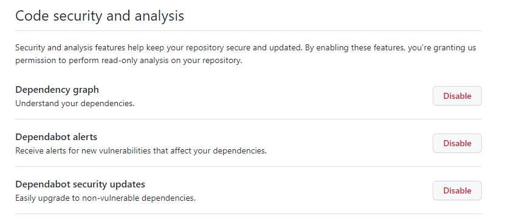

### License
We strongly suggest that you use the [Apache 2.0 License](https://www.apache.org/licenses/LICENSE-2.0).
If you use this repo as a template the license will be automatically applied to your repo.

If you don't use this template you should select the Apache License on repo creation:


If you use open-source 3rd Party Software please check the [license compatibility](https://joinup.ec.europa.eu/collection/eupl/solution/joinup-licensing-assistant/jla-compatibility-checker) 

### Copyright Header

Each file that contains code from yourself should contain a copyright header in the following format:
````
Copyright (c) 2022 Software AG, Darmstadt, Germany and/or Software AG USA Inc., Reston, VA, USA,
and/or its subsidiaries and/or its affiliates and/or their licensors.

SPDX-License-Identifier: Apache-2.0

Licensed under the Apache License, Version 2.0 (the "License");
you may not use this file except in compliance with the License.
You may obtain a copy of the License at

     http://www.apache.org/licenses/LICENSE-2.0

Unless required by applicable law or agreed to in writing, software
distributed under the License is distributed on an "AS IS" BASIS,
WITHOUT WARRANTIES OR CONDITIONS OF ANY KIND, either express or implied.
See the License for the specific language governing permissions and
limitations under the License.

````

## Topics

For Cumulocity IoT content please add the topics

* cumulocity-IoT OPCUA agent
* Device protocol creation (automation)


* Overview about the Repo / Component --
   This microservice will be used to automate the OPCUA device protocol creation based on below CSV template. This uses OPCUA microservice end points to create a    device protocol automatically and enable them. Below is the sample device protocol (CSV) file.


* Installation
   This microservice can be built and run locally pointing to a tenant or can be deployed on a target tenant where this device protocol needs to be created. The build and installation will be same as standard cumulocity IoT microservice build & deploy steps - https://cumulocity.com/guides/microservice-sdk/concept/#configure-the-microservice-utility-tool
* Footer to TechCommunity

Please always add the following footer to your README.md

---

These tools are provided as-is and without warranty or support. They do not constitute part of the Software AG product suite. Users are free to use, fork and modify them, subject to the license agreement. While Software AG welcomes contributions, we cannot guarantee to include every contribution in the master project.

For more information you can Ask a Question in the [TECH Community Forums](https://tech.forums.softwareag.com/tag/Cumulocity-IoT).

Contact us at [TECHcommunity](mailto:Communities@softwareag.com?subject=Github/SoftwareAG) if you have any questions.

---

## Github Settings

There are multiple settings you can make use of in your repository.
First of all we suggest to enable the Code Security and analysis functionality which includes a [Dependency graph](https://docs.github.com/en/code-security/supply-chain-security/understanding-your-software-supply-chain/about-the-dependency-graph), [Dependabot alerts](https://docs.github.com/en/code-security/dependabot/dependabot-alerts/about-dependabot-alerts) and [Dependabot security updates](https://docs.github.com/en/code-security/dependabot/dependabot-security-updates/about-dependabot-security-updates).



# Questions about this template

If you have any questions or suggestions regarding this template please create an [issue](https://github.com/SoftwareAG/cumulocity-iot-template/issues/new)

---
# PLEASE REPLACE THE PART ABOVE WITH YOUR OWN CONTENT !!!


